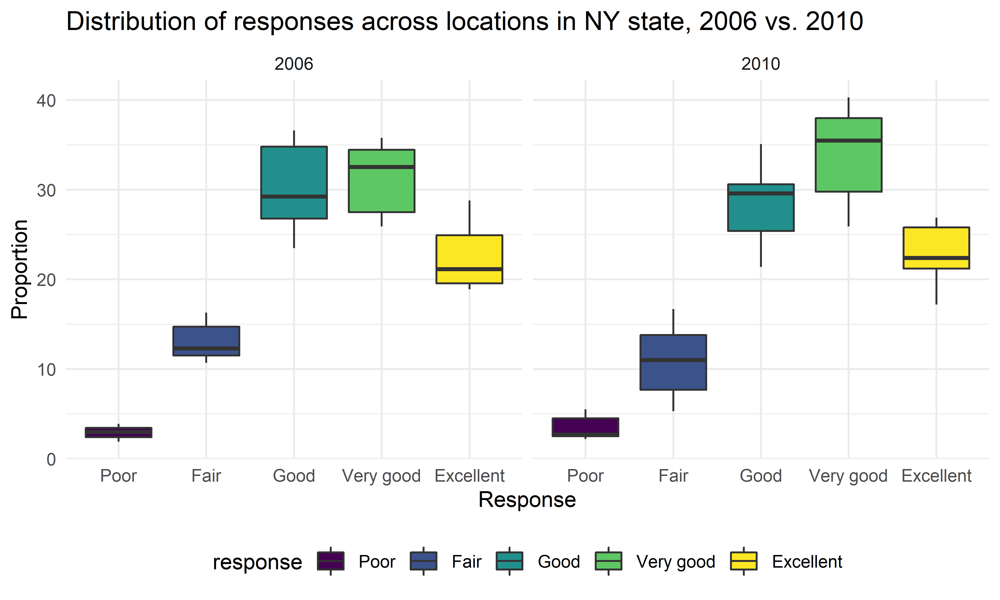
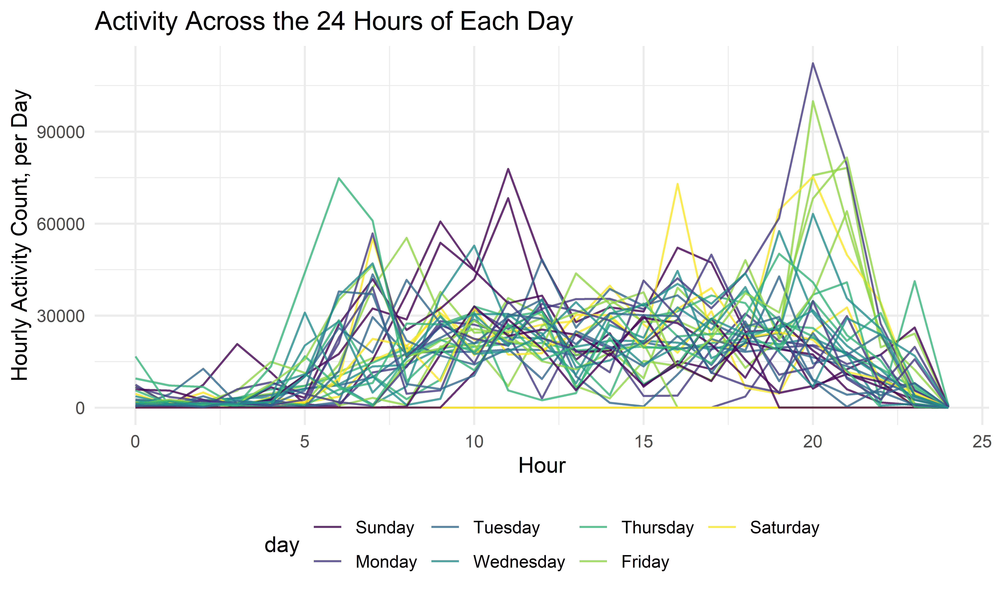

p8105\_hw3\_kk3154
================
Kristen King
10/20/2021

``` r
library(tidyverse)
library(viridis)
library(ggridges)

knitr::opts_chunk$set(
  fid.width = 6, 
  fig.asp = 0.6,
  out.width = "90%")

theme_set(theme_minimal() + theme(legend.position = "bottom"))

options(
  ggplot2.continuous.color = "viridis",
  ggplot2.continuous.fill = "viridis")


scale_color_discrete = scale_colour_viridis_d
scale_fill_discrete = scale_fill_viridis_d
```

## Problem 1 - Exploring Instacart Data

Loading data from p8105.datasets:

``` r
library(p8105.datasets)
data("instacart")
```

**1.1** Describe the dataset, including size and structure of the data,
key variables, and giving illustrative examples of observations.

``` r
insta_df = instacart
```

The Instacart dataset contains 15 variables of data on 1384617 products
ordered in the instacart app. Each row is one product from each order,
and some identifying variables include order ID, customer ID, day/time
of order, and time since last order. Key variables for potential
analysis include product, aisle, and department IDs and names. For
example, observation \#9 in the dataset indicates customer number 79431
ordered Grated Pecorino Romano Cheese from the specialty cheeses aisle
in the dairy eggs department as part of their order number 36 at time
18:00 on the 6th day of the week.

**1.2** How many aisles are there, and which aisles are the most items
ordered from?

``` r
aisle_count = 
  insta_df %>% 
  mutate(aisle = factor(aisle)) %>% 
  group_by(aisle) %>% 
  summarize(n_items = n()) %>% 
  arrange(desc(n_items)) 

aisle_count %>%  
  head() %>% 
  knitr::kable()
```

| aisle                         | n\_items |
|:------------------------------|---------:|
| fresh vegetables              |   150609 |
| fresh fruits                  |   150473 |
| packaged vegetables fruits    |    78493 |
| yogurt                        |    55240 |
| packaged cheese               |    41699 |
| water seltzer sparkling water |    36617 |

There are 134 aisles in this dataset, and the fresh vegetables, fresh
fruits, packaged vegetables fruits, yogurt, packaged cheese, water
seltzer sparkling water aisles have the most items ordered from them.

**1.3** Make a plot that shows the number of items ordered in each
aisle, limiting this to aisles with more than 10000 items ordered.
Arrange aisles sensibly, and organize your plot so others can read it.

``` r
insta_df %>% 
  mutate(aisle = factor(aisle)) %>% 
  group_by(aisle) %>% 
  summarize(n_items = n()) %>% 
  filter(n_items > 10000) %>% 
  mutate(
    aisle = fct_reorder(aisle, n_items)
  ) %>% 
  ggplot(aes(x = aisle, y = n_items, xaxt = "")) + 
  geom_point(alpha = 0.3) + 
  labs(
    title = "Count of Items Ordered per Aisle",
    y = "Number of Items",
    x = "Aisle",
    caption = "Note: Only depicts aisles with >10,000 items ordered."
  ) + 
  theme(axis.text.x = element_text(angle = 90, vjust = 0.5, hjust = 1))
```


**1.4** Make a table showing the three most popular items in each of the
aisles “baking ingredients”, “dog food care”, and “packaged vegetables
fruits”. Include the number of times each item is ordered in your table.

``` r
insta_df %>% 
  mutate(aisle = factor(aisle)) %>% 
  group_by(aisle, product_name) %>% 
  summarize(n_items = n()) %>% 
  filter(aisle %in% c("baking ingredients", "dog food care", "packaged vegetables fruits")) %>% 
  mutate(
    item_rank = min_rank(desc(n_items))
    ) %>% 
  filter(item_rank < 4) %>% 
  select(aisle, item_rank, product_name, n_items) %>% 
  arrange(aisle, item_rank) %>% 
  knitr::kable()
```

| aisle                      | item\_rank | product\_name                                 | n\_items |
|:---------------------------|-----------:|:----------------------------------------------|---------:|
| baking ingredients         |          1 | Light Brown Sugar                             |      499 |
| baking ingredients         |          2 | Pure Baking Soda                              |      387 |
| baking ingredients         |          3 | Cane Sugar                                    |      336 |
| dog food care              |          1 | Snack Sticks Chicken & Rice Recipe Dog Treats |       30 |
| dog food care              |          2 | Organix Chicken & Brown Rice Recipe           |       28 |
| dog food care              |          3 | Small Dog Biscuits                            |       26 |
| packaged vegetables fruits |          1 | Organic Baby Spinach                          |     9784 |
| packaged vegetables fruits |          2 | Organic Raspberries                           |     5546 |
| packaged vegetables fruits |          3 | Organic Blueberries                           |     4966 |

**1.5** Make a table showing the mean hour of the day at which Pink Lady
Apples and Coffee Ice Cream are ordered on each day of the week; format
this table for human readers (i.e. produce a 2 x 7 table).

``` r
insta_df %>% 
  mutate(
    dow = factor(order_dow, labels = c("Sun", "Mon", "Tues", "Weds", "Thurs", "Fri", "Sat"), ordered = TRUE)
  ) %>% 
  group_by(product_name, dow) %>% 
  filter(product_name %in% c("Pink Lady Apples", "Coffee Ice Cream")) %>% 
  summarize(mean_time = mean(order_hour_of_day)) %>% 
  pivot_wider(
    names_from = "dow",
    values_from = "mean_time" 
  ) %>% 
  knitr::kable(digits = 2)
```

    ## `summarise()` has grouped output by 'product_name'. You can override using the `.groups` argument.

| product\_name    |   Sun |   Mon |  Tues |  Weds | Thurs |   Fri |   Sat |
|:-----------------|------:|------:|------:|------:|------:|------:|------:|
| Coffee Ice Cream | 13.77 | 14.32 | 15.38 | 15.32 | 15.22 | 12.26 | 13.83 |
| Pink Lady Apples | 13.44 | 11.36 | 11.70 | 14.25 | 11.55 | 12.78 | 11.94 |

## Problem 2 - Cleaning and Exploring BRFSS Data

Loading the BRFSS data:

``` r
data("brfss_smart2010")
```

**2.1 Data cleaning:**

-   format the data to use appropriate variable names

-   focus on the “Overall Health” topic

-   include only responses from “Excellent” to “Poor”

-   organize responses as a factor taking levels ordered from “Poor” to
    “Excellent”

``` r
brfss_df = brfss_smart2010 %>% 
  janitor::clean_names() %>% 
  rename(state = locationabbr, county = factor("locationdesc")) %>% 
  filter(topic == "Overall Health", response %in% c("Poor", "Fair", "Good", "Very good", "Excellent")) %>%
  mutate(response = factor(response, levels = c("Poor", "Fair", "Good", "Very good", "Excellent"), ordered=TRUE)) %>% 
  arrange(response)
```

**2.2** In 2002, the states that were observed at 7 or more locations
were:

``` r
brfss_df %>% 
  filter(year == 2002) %>% 
  group_by(state) %>% 
  summarize(n_loc = n_distinct(county)) %>% 
  filter(n_loc >= 7) %>% 
  arrange(desc(n_loc)) %>% 
  knitr::kable()
```

| state | n\_loc |
|:------|-------:|
| PA    |     10 |
| MA    |      8 |
| NJ    |      8 |
| CT    |      7 |
| FL    |      7 |
| NC    |      7 |

In 2010, the states that were observed at 7 or more locations were:

``` r
brfss_df %>% 
  filter(year == 2010) %>% 
  group_by(state) %>% 
  summarize(n_loc = n_distinct(county)) %>% 
  filter(n_loc >= 7) %>% 
  arrange(desc(n_loc)) %>% 
  knitr::kable()
```

| state | n\_loc |
|:------|-------:|
| FL    |     41 |
| NJ    |     19 |
| TX    |     16 |
| CA    |     12 |
| MD    |     12 |
| NC    |     12 |
| NE    |     10 |
| WA    |     10 |
| MA    |      9 |
| NY    |      9 |
| OH    |      8 |
| CO    |      7 |
| PA    |      7 |
| SC    |      7 |

**2.3** Construct a dataset that is limited to `Excellent` responses,
and contains year, state, and a variable that averages the `data_value`
across locations within a state.

``` r
brfss_df_exc_only = brfss_df %>% 
  filter(response == "Excellent") %>% 
  group_by(year, state) %>% 
  summarize(mean_data_value = mean(data_value, na.rm = TRUE))
```

    ## `summarise()` has grouped output by 'year'. You can override using the `.groups` argument.

**2.4** Make a “spaghetti” plot of this average value over time within a
state (that is, make a plot showing a line for each state across years –
the `geom_line` geometry and `group` aesthetic will help).

``` r
brfss_df_exc_only %>% 
  ggplot(aes(x = year, y = mean_data_value)) +
  geom_line(aes(group = state, color = state)) + 
  scale_color_viridis_d() + 
  theme(
    legend.position = "right",
    legend.text = element_text(size = 7)
    ) + 
  labs(
    title = "Proportion of 'Excellent' Responses over Time, by State", 
    y = "Mean Value Across State Locations",
    x = "Year"
  )
```


**2.5** Make a two-panel plot showing, for the years 2006, and 2010,
distribution of data\_value for responses (“Poor” to “Excellent”) among
locations in NY State.

``` r
brfss_df %>% 
  filter(year %in% c(2006, 2010), state == "NY") %>% 
  ggplot(aes(x = response, y = data_value, fill = response)) +
  geom_boxplot() +
  facet_grid(. ~ year) + 
  labs(
    title = "Distribution of responses across locations in NY state, 2006 vs. 2010", 
    x = "Response", 
    y = "Proportion"
  )
```



## Problem 3 - Accelerometer Data

35 days of accelerometer data where activity.\* variables are activity
counts from a patient with congestive heart failure for each minute of a
24-hour day starting at midnight.

**3.1** Loading, tidying, and wrangling data.

This final dataset includes all originally observed variables and
values, has useful variable names, includes a weekday vs. weekend
variable, and encodes data with reasonable variable classes.

``` r
acc_df = read_csv("data/accel_data.csv") %>% 
  janitor::clean_names() %>% 
  mutate(weekend = ifelse(day %in% c("Saturday", "Sunday"), 1, 0)) %>% 
  mutate(weekend = factor(weekend)) %>% 
  mutate(day = factor(day, levels = c("Sunday", "Monday", "Tuesday", "Wednesday", "Thursday", "Friday", "Saturday"), ordered=TRUE)) %>% 
  pivot_longer(
    activity_1:activity_1440,
    names_to = "minute", 
    names_prefix = "activity_", 
    values_to = "activity_count"
  ) %>% 
  mutate(minute = as.numeric(minute))
```

    ## Rows: 35 Columns: 1443

    ## -- Column specification --------------------------------------------------------
    ## Delimiter: ","
    ## chr    (1): day
    ## dbl (1442): week, day_id, activity.1, activity.2, activity.3, activity.4, ac...

    ## 
    ## i Use `spec()` to retrieve the full column specification for this data.
    ## i Specify the column types or set `show_col_types = FALSE` to quiet this message.

**3.2** Describing the resulting dataset (e.g. what variables exist, how
many observations, etc.):

The original accelerometer dataset included observations from 35 days
with 1443 columns, including 1440 activity count variables for each
minute in each 24 hour day. After tidying, the accelerometer dataset now
contains 50400 observations at the minute level that can be further
grouped by week, day, or day of the week. This tidy, longer datset now
contains only 6 variables: week, day\_id, day, weekend, minute,
activity\_count.

**3.3** Traditional analyses of accelerometer data focus on the total
activity over the day. Using your tidied dataset, aggregate across
minutes to create a total activity variable for each day, and create a
table showing these totals. Are any trends apparent?

``` r
acc_df %>% 
  group_by(day_id) %>%
  summarize(total_activity = sum(activity_count)) %>% 
  knitr::kable(col.names = c("Study Day", "Total Activity"))
```

| Study Day | Total Activity |
|----------:|---------------:|
|         1 |      480542.62 |
|         2 |       78828.07 |
|         3 |      376254.00 |
|         4 |      631105.00 |
|         5 |      355923.64 |
|         6 |      307094.24 |
|         7 |      340115.01 |
|         8 |      568839.00 |
|         9 |      295431.00 |
|        10 |      607175.00 |
|        11 |      422018.00 |
|        12 |      474048.00 |
|        13 |      423245.00 |
|        14 |      440962.00 |
|        15 |      467420.00 |
|        16 |      685910.00 |
|        17 |      382928.00 |
|        18 |      467052.00 |
|        19 |      371230.00 |
|        20 |      381507.00 |
|        21 |      468869.00 |
|        22 |      154049.00 |
|        23 |      409450.00 |
|        24 |        1440.00 |
|        25 |      260617.00 |
|        26 |      340291.00 |
|        27 |      319568.00 |
|        28 |      434460.00 |
|        29 |      620860.00 |
|        30 |      389080.00 |
|        31 |        1440.00 |
|        32 |      138421.00 |
|        33 |      549658.00 |
|        34 |      367824.00 |
|        35 |      445366.00 |

``` r
acc_df %>% 
  group_by(day_id) %>% 
  summarize(total_activity = sum(activity_count)) %>% 
  ggplot(aes(x = day_id, y = total_activity)) + 
  geom_point(alpha = 0.8)
```


``` r
acc_df %>% 
  group_by(day) %>% 
  summarize(total_activity = sum(activity_count)) %>% 
  knitr::kable(col.names = c("Day of the Week", "Total Activity"))
```

| Day of the Week | Total Activity |
|:----------------|---------------:|
| Sunday          |        1919213 |
| Monday          |        1858699 |
| Tuesday         |        1799238 |
| Wednesday       |        2129772 |
| Thursday        |        2091151 |
| Friday          |        2291711 |
| Saturday        |        1369237 |

``` r
acc_df %>% 
  group_by(day) %>% 
  summarize(total_activity = sum(activity_count)) %>% 
  ggplot(aes(x = day, y = total_activity)) + 
  geom_point(alpha = 0.8)
```


When aggregating by study day (1-35), there is no obvious overall
pattern. There are a few days with very little activity, and in general
the activity fluctuates over time, where it’s not consistently higher or
lower for many days in a row.

When aggregating by day of the week, it becomes more apparent that
Saturdays have much less activity than the other days of the week.
Assuming a Sunday start to the week, activity tends to be higher later
in the week, with the maximum activity observed on Fridays, until the
sudden drop and minimum activity on Saturdays.

**3.4** Accelerometer data allows the inspection activity over the
course of the day. Make a single-panel plot that shows the 24-hour
activity time courses for each day and use color to indicate day of the
week.

``` r
acc_df %>% 
  mutate(hour = round(floor(minute/60))) %>% 
  group_by(day_id, day, hour) %>%
  summarize(hourly_total = sum(activity_count)) %>% 
  ggplot(aes(x = hour, y = hourly_total, color = day)) + 
  geom_line(aes(group = day_id), alpha = 0.8) + 
  labs(
    title = "Activity Across the 24 Hours of Each Day", 
    y = "Hourly Activity Count, per Day",
    x = "Hour"
  )
```

    ## `summarise()` has grouped output by 'day_id', 'day'. You can override using the `.groups` argument.



Based on this graph, we can conclude that this patient is very active on
Friday and Saturday nights, whereas on weekdays there is more activity
earlier in the day as well. They also have a late morning/early
afternoon bump in activity on Sundays. This patient’s daily activity
tends to wind down around between 10:00 and 11:00 pm, and they are
mostly inactive between the hours of midnight and 5:00 am. Notably there
are Saturday(s) with no or very little activity recorded all day.
